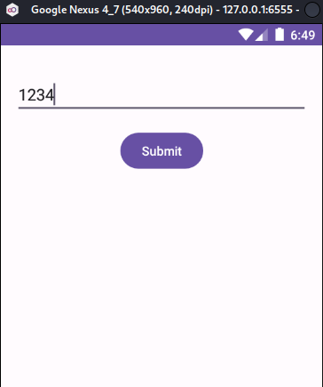

# Mobile Hacking Lab - Secure Notes
##### https://www.mobilehackinglab.com/course/lab-secure-notes
##### Description 
This lab immerses you in the intricacies of Android content providers, challenging you to crack a PIN code protected by a content provider within an Android application.

### Decompile and Static analysis
```bash
SAMobile.sh extract com.mobilehackinglab.securenotes.apk
```
*NOTE: You can use [SAMobile]()*

Analyze the `AndroidManifest.xml` and keywords

#### Keywords 
```bash
com.mobilehackinglab.securenotes_extracted/assets/config.properties:1:encryptedSecret=bTjBHijMAVQX+CoyFbDPJXRUSHcTyzGaie3OgVqvK5w=
```
Looks like the encrypted secret in the app 
*NOTE: i ran `hashid` and tried decoding so it is most likely encrypted rather than the name itself :)*

#### Package & SDK:
```xml
package="com.mobilehackinglab.securenotes"
compileSdkVersion="34"
android:debuggable="true"
android:allowBackup="true"
```
The `debuggable=true` flag we can attach a debugger and inspect memory easily.
The `allowBackup=true` flag we can pull `SharedPreferences` and dump app data.

#### Providers
```bash
<provider android:authorities="com.mobilehackinglab.securenotes.secretprovider" android:enabled="true" android:exported="true" android:name="com.mobilehackinglab.securenotes.SecretDataProvider"/>
```
The application uses an exported Content Provider to handle the retrieval and decryption of the **"secret."**
#### Permissions
```xml
<permission android:name="com.mobilehackinglab.securenotes.DYNAMIC_RECEIVER_NOT_EXPORTED_PERMISSION" android:protectionLevel="signature"/>
```
This is Android Studio boilerplate for dynamic receivers. (likely NOT important)

### App Run


the app main screen is a PIN screen that **only** accepts numbers.

##### Get shell on AVD
```bash
adb shell
```

##### Analyze /data/data
Navigate to `/data/data/com.mobilehackinglab.securenotes`

```bash
vbox86p:/data/data/com.mobilehackinglab.securenotes # ls -la
total 40
drwx------  5 u0_a65 u0_a65 4096 2026-02-12 06:49 .
drwxrwx--x 89 system system 4096 2026-02-12 06:48 ..
drwxrwx--x  2 u0_a65 u0_a65 4096 2026-02-12 06:48 cache
drwxrwx--x  2 u0_a65 u0_a65 4096 2026-02-12 06:48 code_cache
drwxrwx--x  2 u0_a65 u0_a65 4096 2026-02-12 06:49 files
vbox86p:/data/data/com.mobilehackinglab.securenotes/files # ls            
vbox86p:/data/data/com.mobilehackinglab.securenotes/code_cache # ls      
vbox86p:/data/data/com.mobilehackinglab.securenotes/cache # ls
```
NO Data is stored on the `/data` directory until now.

##### Get the current activity
```bash
adb shell "dumpsys activity | grep mResumedActivity"
mResumedActivity: ActivityRecord{f3e1dec u0 com.mobilehackinglab.securenotes/.MainActivity t5}
```
Clearly this is the main activity.

### Static code analysis
#### The MainActivity
```java
 public static final void onCreate$lambda$0(MainActivity this$0, View it) {
        Intrinsics.checkNotNullParameter(this$0, "this$0");
        ActivityMainBinding activityMainBinding = this$0.binding;
        if (activityMainBinding == null) {
            Intrinsics.throwUninitializedPropertyAccessException("binding");
            activityMainBinding = null;
        }
        String enteredPin = activityMainBinding.pinEditText.getText().toString();
        this$0.querySecretProvider(enteredPin);
    }
```
The code get the string in `enteredPin` string and pass it to `querySecretProvider` function

```java
  /*
            r8 = this;
            java.lang.String r0 = "content://com.mobilehackinglab.securenotes.secretprovider"
            android.net.Uri r0 = android.net.Uri.parse(r0)
            java.lang.StringBuilder r1 = new java.lang.StringBuilder
            r1.<init>()
            java.lang.String r2 = "pin="
            java.lang.StringBuilder r1 = r1.append(r2)
            java.lang.StringBuilder r1 = r1.append(r9)
            java.lang.String r7 = r1.toString()
            android.content.ContentResolver r1 = r8.getContentResolver()
            r3 = 0
            r5 = 0
            r6 = 0
            r2 = r0
            r4 = r7
            android.database.Cursor r1 = r1.query(r2, r3, r4, r5, r6)
            r2 = 0
            if (r1 == 0) goto L63
            r3 = r1
            r4 = 0
            boolean r3 = r3.moveToFirst()
            if (r3 == 0) goto L33
            r3 = r1
            goto L34
        L33:
            r3 = r2
        L34:
            if (r3 == 0) goto L63
        L37:
            java.lang.String r4 = "Secret"
            int r3 = r3.getColumnIndex(r4)
            java.lang.Integer r3 = java.lang.Integer.valueOf(r3)
            r4 = r3
            java.lang.Number r4 = (java.lang.Number) r4
            int r4 = r4.intValue()
            r5 = 0
            r6 = -1
            if (r4 == r6) goto L4f
            r6 = 1
            goto L50
        L4f:
            r6 = 0
        L50:
            if (r6 == 0) goto L53
            goto L54
        L53:
            r3 = r2
        L54:
            if (r3 == 0) goto L63
        L57:
            java.lang.Number r3 = (java.lang.Number) r3
            int r3 = r3.intValue()
            r4 = 0
            java.lang.String r3 = r1.getString(r3)
            goto L64
        L63:
            r3 = r2
        L64:
            if (r3 != 0) goto L68
            java.lang.String r3 = "[ERROR: Incorrect PIN]"
        L68:
            com.mobilehackinglab.securenotes.databinding.ActivityMainBinding r4 = r8.binding
            if (r4 != 0) goto L73
            java.lang.String r4 = "binding"
            kotlin.jvm.internal.Intrinsics.throwUninitializedPropertyAccessException(r4)
            goto L74
        L73:
            r2 = r4
        L74:
            android.widget.TextView r2 = r2.resultTextView
            r4 = r3
            java.lang.CharSequence r4 = (java.lang.CharSequence) r4
            r2.setText(r4)
            if (r1 == 0) goto L81
            r1.close()
        L81:
            return
        */
        throw new UnsupportedOperationException("Method not decompiled: com.mobilehackinglab.securenotes.MainActivity.querySecretProvider(java.lang.String):void");
    }
}
```
*NOTE: the code is in kotlin so JADX can't fully decompile it* 

`querySecretProvider`: it defines the address of the data: `content://com.mobilehackinglab.securenotes.secretprovider`. This is like a web URL, but for internal Android data.

**Vulnerable Query Interface:** The MainActivity sends the PIN (`enteredPin` string) to the provider (`querySecretProvider`) using the selection parameter of the query method in the format `pin=<entered_pin>`.

#### Validate the URI
```bash
adb shell content query --uri content://com.mobilehackinglab.securenotes.secretprovider --where "pin=0000"
No result found.
```
So the URI accept queries we need to bruteforce it to get the right PIN use [bruteForce.sh](./bruteForce.sh)

The PIN is **0299** we put the output in the [secret.txt](./secret.txt) file.

```bash
adb shell content query --uri content://com.mobilehackinglab.securenotes.secretprovider --where "pin=0299"             
��%���e▒*�h��Uis1�̖��l
```
the output shows that secret is a False positive. We need to tune our bruteforce methodology to skip the False positive.

#### Secret Data Provider analysis
##### PIN Normalization:
```Java
String str = String.format("%04d", Arrays.copyOf(new Object[]{Integer.valueOf(Integer.parseInt(strRemovePrefix))}, 1));
```
This is critical. Even if you provide pin=1, the code converts it to 0001. The total search space is exactly 0000 to 9999 (10,000 possibilities).
Key Derivation (PBKDF2):
The app uses `PBKDF2WithHmacSHA1` with a salt and an iterationCount from the assets file. This is a "slow" hashing function designed to make brute-forcing harder, but with only 10,000 possibilities, it's **still very weak**.
##### The Decryption Bug (The False Positive):
```Java
try {
    byte[] decryptedBytes = cipher.doFinal(bArr2);
    return new String(decryptedBytes, Charsets.UTF_8);
} catch (Exception e) {
    return null;
}
```

In AES-CBC with PKCS5 padding, the cipher checks the last bytes of the decrypted data to ensure they follow a specific padding pattern.
If the PIN is wrong, the decryption usually fails the padding check and **throws an exception**, returning null (which shows as "No result found").
However, mathematically, there is a `1` in `256` chance that an incorrect PIN will result in "garbage" data that accidentally looks like it has valid padding. This is exactly what happened with **PIN 0299**.

#### BruteForce with filtration
Use [bruteForceFiltered.sh](./bruteForceFiltered.sh) this script was edited based on the findings of the `Secret Data Provider analysis` to filter the FP.

```bash
------------------------------------------------
[+] REAL SECRET FOUND!
PIN: 2580
RESULT: Row: 0 Secret=CTF{D1d_y0u_gu3ss_1t!1?}
------------------------------------------------
```

>Find More on ==> github.com/MedhatHassan 