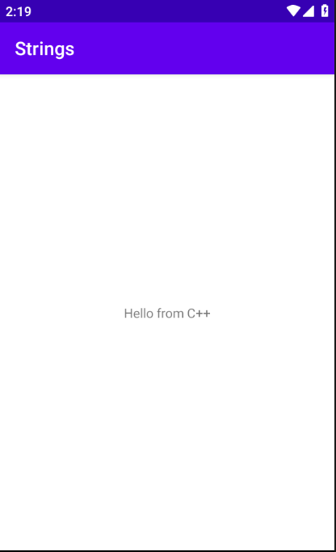
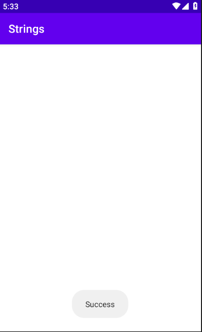
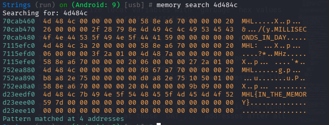

# Mobile Hacking Lab - strings
##### https://www.mobilehackinglab.com/course/lab-strings
##### Description 
Find a hidden flag in the application by investigating the app components and by using dynamic instrumentation.

### Decompile and Static analysis
```bash
SAMobile.sh extract com.mobilehackinglab.strings.apk
```
*NOTE: You can use [SAMobile]()*

Analyze the `AndroidManifest.xml` and keywords

#### Package & SDK:
```xml
package="com.mobilehackinglab.challenge"
compileSdkVersion="34"
android:debuggable="true"
android:allowBackup="true"
```
The `debuggable=true` flag we can attach a debugger and inspect memory easily.
The `allowBackup=true` flag we can pull `SharedPreferences` and dump app data.

#### Permissions
```xml
<permission android:name="com.mobilehackinglab.challenge.DYNAMIC_RECEIVER_NOT_EXPORTED_PERMISSION" android:protectionLevel="signature"/>
```
This is Android Studio boilerplate for dynamic receivers. (likely NOT important)

#### The MainActivity
```xml
<activity
    android:name="com.mobilehackinglab.challenge.MainActivity"
    android:exported="true">
    <intent-filter>
        <action android:name="android.intent.action.MAIN"/>
        <category android:name="android.intent.category.LAUNCHER"/>
    </intent-filter>
</activity>
```
Just launches the app

#### Exported deep-link Activity2
```xml
<activity
    android:name="com.mobilehackinglab.challenge.Activity2"
    android:exported="true">
    <intent-filter>
        <action android:name="android.intent.action.VIEW"/>
        <category android:name="android.intent.category.DEFAULT"/>
        <category android:name="android.intent.category.BROWSABLE"/>
        <data android:scheme="mhl" android:host="labs"/>
    </intent-filter>
</activity>
```
- The app responds to URLs like `mhl://labs`
- accepts external intents
- It’s browsable
- It has custom scheme

### App Run


##### Get shell on AVD
```bash
adb shell
```

##### Analyze /data/data
Navigate to `/data/data/com.mobilehackinglab.challenge`

```bash
vbox86p:/data/data/com.mobilehackinglab.challenge # ls -la
total 40
drwx------  5 u0_a65 u0_a65 4096 2026-02-12 06:49 .
drwxrwx--x 89 system system 4096 2026-02-12 06:48 ..
drwxrwx--x  2 u0_a65 u0_a65 4096 2026-02-12 06:48 cache
drwxrwx--x  2 u0_a65 u0_a65 4096 2026-02-12 06:48 code_cache
drwxrwx--x  2 u0_a65 u0_a65 4096 2026-02-12 06:49 files
vbox86p:/data/data/com.mobilehackinglab.challenge/files # ls 
profileInstalled
vbox86p:/data/data/com.mobilehackinglab.challenge/code_cache # ls      
vbox86p:/data/data/com.mobilehackinglab.challenge/cache # ls
```
We found only `profileInstalled` 

```bash
adb pull /data/data/com.mobilehackinglab.challenge/files/profileInstalled . 
```

##### Get the current activity
```bash
adb shell "dumpsys activity | grep mResumedActivity"
mResumedActivity: ActivityRecord{caf4fcd u0 com.mobilehackinglab.challenge/.MainActivity t5}
```
Clearly this is the main activity. 

### Static Code analysis
#### Main activity
```java
public final void KLOW() {
        SharedPreferences sharedPreferences = getSharedPreferences("DAD4", 0);
        SharedPreferences.Editor editor = sharedPreferences.edit();
        Intrinsics.checkNotNullExpressionValue(editor, "edit(...)");
        SimpleDateFormat sdf = new SimpleDateFormat("dd/MM/yyyy", Locale.getDefault());
        String cu_d = sdf.format(new Date());
        editor.putString("UUU0133", cu_d);
        editor.apply();
    }
```
- Create a **private** shared preferences file `DAD4.xml` 
- Get the current date then write it in the file
- The final format `<string name="UUU0133">14/02/2026</string>` in `DAD4.xml` file

#### Activity 2
```java
protected void onCreate(Bundle savedInstanceState) throws BadPaddingException, NoSuchPaddingException, IllegalBlockSizeException, NoSuchAlgorithmException, InvalidKeyException, InvalidAlgorithmParameterException {
        super.onCreate(savedInstanceState);
        setContentView(R.layout.activity_2);
        SharedPreferences sharedPreferences = getSharedPreferences("DAD4", 0);
        String u_1 = sharedPreferences.getString("UUU0133", null);
        boolean isActionView = Intrinsics.areEqual(getIntent().getAction(), "android.intent.action.VIEW");
        boolean isU1Matching = Intrinsics.areEqual(u_1, cd());
        if (isActionView && isU1Matching) {
            Uri uri = getIntent().getData();
            if (uri != null && Intrinsics.areEqual(uri.getScheme(), "mhl") && Intrinsics.areEqual(uri.getHost(), "labs")) {
                String base64Value = uri.getLastPathSegment();
                byte[] decodedValue = Base64.decode(base64Value, 0);
                if (decodedValue != null) {
                    String ds = new String(decodedValue, Charsets.UTF_8);
                    byte[] bytes = "your_secret_key_1234567890123456".getBytes(Charsets.UTF_8);
                    Intrinsics.checkNotNullExpressionValue(bytes, "this as java.lang.String).getBytes(charset)");
                    String str = decrypt("AES/CBC/PKCS5Padding", "bqGrDKdQ8zo26HflRsGvVA==", new SecretKeySpec(bytes, "AES"));
                    if (str.equals(ds)) {
                        System.loadLibrary("flag");
                        String s = getflag();
                        Toast.makeText(getApplicationContext(), s, 1).show();
                        return;
                    } else {
                        finishAffinity();
                        finish();
                        System.exit(0);
                        return;
                    }
                }
                finishAffinity();
                finish();
                System.exit(0);
                return;
            }
            finishAffinity();
            finish();
            System.exit(0);
            return;
        }
        finishAffinity();
        finish();
        System.exit(0);
    }
```
- Shared Preferences check: 
    - The Gatekeeper: SharedPreferences & Date Check
    Inside `Activity2.onCreate()`, the app performs a strict check:
    - It reads a value from SharedPreferences (`DAD4.xml`) with the key `UUU0133` (string name).
    - It compares this value to cd(), which returns the current date in `dd/MM/yyyy` format.
    - If they don't match, the app exits immediately (`System.exit(0)`).
- Deep link
    -   `getIntent().getAction() == "android.intent.action.VIEW"` Launched
    - URI scheme `uri.getScheme() == "mhl"` `uri.getHost() == "labs"`
    - Extract Base64 From Path `String ds = new String(decodedValue, UTF_8);` So the path is `mhl://labs/<BASE64>`
- The Key encryption 
    -  Hardcoded AES keys and IVs allow for offline decryption of the required "challenge" string.
    - Algorithm: `AES/CBC/PKCS5Padding` | Ciphertext: `bqGrDKdQ8zo26HflRsGvVA==` | Key: `your_secret_key_1234567890123456` So we need the IV to decrypt the Ciphertext
    - the process:
        - Takes the last path segment of the URI.
        - Decodes it from Base64.
        - Compares it to a locally decrypted string.
        - If they match, it loads `libflag.so`, calls `getflag()`, and shows the flag in a Toast.


#### Activity2Kt
```java
public final class Activity2Kt {
    private static String cu_d = null;
    public static final String fixedIV = "1234567890123456";
}
```
store the IV in a final string. So we can decrypt the Key

#### Decrypt the key
Use [Decrypt](Decrypt.py) to decrypt the hardcoded ciphertext.
```txt
Decrypted string: mhl_secret_1337☺
```
the targeted string is `mhl_secret_1337`

### Deep link exploit
1. we will bypass the date check via inject the current date into the app's preferences. 
2. Build the URI with the targeted structure and the decrypted key encoded as base64
3. Fire the deep link with the URI and trigger Activity2

*NOTE: `KLOW()` is never called in the original app code. This is why the manual SharedPreferences injection is necessary—the app is effectively "broken" by design to force you to use adb.*

Use the script [Deeplink](Deeplink.sh)

After the activity starts, look for a Toast message at the bottom of the Android screen.



NO flag just success message. 

### Analysis `libflag.so`
This Ghidra output confirms why you only saw the word "Success" in the Toast.

*Note: the decompiled code is in [DecompiledLibflagso](DecompiledLibflagso.c)*

The function `Java_com_mobilehackinglab_challenge_Activity2_getflag` (the one we triggered) finishes by calling `NewStringUTF(param_1,"Success");`. However, before it returns that string, it executes a long series of functions `(flag_fill, flag13, zhs, etc.)` that perform complex math.

So instead of the flag being stored as a plain string, it is being **"reconstructed"** (Runtime String De-obfuscation) in memory.

Look at functions like `zhs()`, `dddff()`, and `flag_fill()`:

They initialize local variables with "garbage" hex values (e.g., local_d0 = 0xffffffafffffffa2).

They run loops (for local_214 = 0; local_214 < 0x12...).

Inside the loops, they perform **XOR** operations and **Bitwise shifts** on those hex values.
The results are **stored into global data addresses** like DAT_00104010, DAT_00104023, etc.

The "Success" Toast is a decoy. The real flag is the final state of the memory at those `DAT_...` addresses after all those functions finish running.

### Use objection to dump the memory
*NOTE: you must deploy frida server on the mobile first :)*


```
memory search 4d484c7b
```
*NOTE: `4d484c7b` is the hex representation of `MHL`*

THE FLAG `MHL{IN_THE_MEMORY}`

>Find More on ==> github.com/MedhatHassan 
